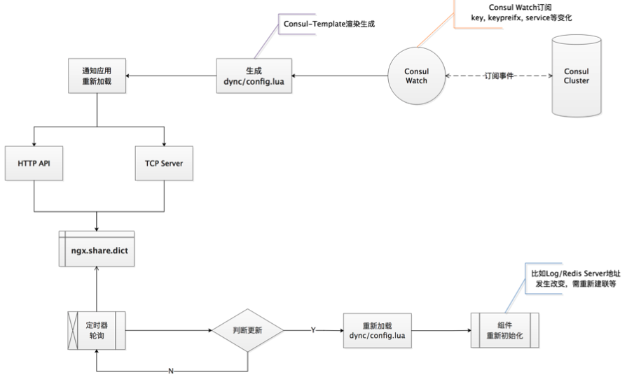
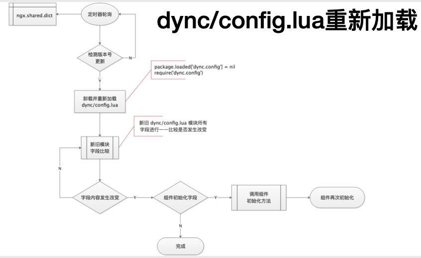
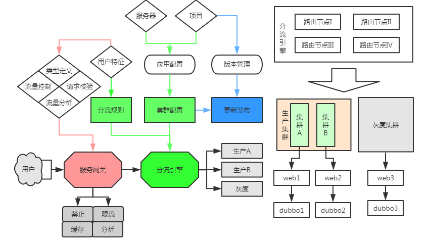

# openresty-demo

## 安装、服务启停

> 做 OpenResty 开发，[`lua-nginx-module官方文档`](https://github.com/openresty/lua-nginx-module) 是你的首选，Lua 语言的库都是同步阻塞的，用的时候要三思

**Homebrew安装：**

```sh
brew install openresty/brew/openresty
```

> **安装过程中可能会出现以下错误：**
>
> curl: (7) Failed to connect to raw.githubusercontent.com port 443: Connection refused Error: openresty: Failed to download resource "openresty-openssl111--patch"
> Download failed: <https://raw.githubusercontent.com/openresty/openresty/master/patches/openssl-1.1.1f-sess_set_get_cb_yield.patch>

**源码安装：**

```sh
# 下载源码
wget -O ngx_openresty-1.9.7.1.tar.gz https://openresty.org/download/ngx_openresty-1.9.7.1.tar.gz

# 解压后编译
cd ~/Workspace/study/openresty/ngx_openresty-1.9.7.1/
# 安装路径：/usr/local/openresty/
./configure --prefix=/usr/local/openresty\
            --with-luajit\
            --with-cc-opt="-I/usr/local/opt/openssl@3/include/ -I/usr/local/opt/pcre/include/" \
            --with-ld-opt="-L/usr/local/opt/openssl@3/lib/ -L/usr/local/opt/pcre/lib/" \
            -j8
```

> **安装过程中可能会出现以下错误：**
>
> ./configure: error: SSL modules require the OpenSSL library.
> You can either do not enable the modules, or install the OpenSSL library
> into the system, or build the OpenSSL library statically from the source
> with nginx by using --with-openssl=<path> option.
>
> **解决方案：**
> --with-cc-opt="-I/usr/local/opt/openssl/include/ -I/usr/local/opt/pcre/include/" \
> --with-ld-opt="-L/usr/local/opt/openssl/lib/ -L/usr/local/opt/pcre/lib/" \
> -j8

**start：**

```sh
openresty -p `pwd`/../openresty-demo
```

**stop：**

```sh
openresty -p `pwd`/../openresty-demo -s stop
```

**查看进程：**

```sh
$ ps -ef|grep openresty
  501 89936     1   0  3:01PM ??         0:00.00 nginx: master process openresty -p /Users/yehong/Workspace/study/go/src/beyondyyh/study-demos/openresty-demo/../openresty-demo
  501 16690 64592   0  3:38PM ttys004    0:00.01 grep openresty
```

## 配置文件

### location匹配规则 [location.conf](conf/servers/location.conf)

| 模式 | 含义 |
| --- | --- |
| location = /uri | `=`表示精确匹配，只有无安全匹配上才能生效 |
| location ^~ /uri | `^~`开头对URL路径进行前缀匹配，并且在正则之前 |
| location ~ pattern | 表示`区分大小写`的正则匹配  |
| location ~* pattern | 表示`不区分大小写`的正则匹配 |
| location /uri | 不带任何修饰符，也表示前缀匹配，但是在正则匹配之后 |
| location / | 通用匹配，任何未匹配到其它location的请求都会匹配到，相当于switch中的default |

> **多个 location 配置的情况下匹配顺序为：**
>
>- 首先精确匹配 `=`
>- 其次前缀匹配 `^~`
>- 其次是按文件中顺序的`正则匹配`
>- 然后匹配不带任何修饰的前缀匹配
>- 最后是交给 `/` 通用匹配
>- 当有匹配成功时候，停止匹配，按当前匹配规则处理请求。

### 获取uri参数 [print_url.conf](conf/servers/print_args.conf)

### 获取请求body、输出响应体 [print_body.conf](conf/servers/print_body.conf)

- nginx.say和ngx.print均为异步输出；
- nginx.say会对响应体多输出一个`\n`，如果是浏览器输出而且没有区别，但是终端调试工具下使用ngx.say会比较方便。

### 日志标准输出

> 自定义日志格式，参考nginx的 [`log_format`](http://nginx.org/en/docs/http/ngx_http_log_module.html#log_format) 环节

如果你的日志需要归集，并且对时效性要求比较高推荐使用 [lua-resty-logger-socket](https://github.com/cloudflare/lua-resty-logger-socket)，
`lua-resty-logger-socket` 的目标是替代 Nginx 标准的 [ngx_http_log_module](http://nginx.org/en/docs/http/ngx_http_log_module.html) 以非阻塞 IO 方式推送 `access log` 到远程服务器上。对远程服务器的要求是支持 `syslog-ng` 的日志服务。

### 简单API Server框架

整体目录结构：

```txt
.
├── README.md
├── client_body_temp
├── conf
│   ├── nginx.conf
│   └── servers
│       ├── my_cache.conf
│       └── simple_api.conf
├── fastcgi_temp
├── logs
│   ├── access.log
│   ├── error.log
│   └── nginx.pid
├── lua
│   ├── comm
│   │   └── param.lua
│   └── simple_api
│       ├── access_check.lua
│       ├── addition.lua
│       ├── division.lua
│       ├── multiplication.lua
│       └── subtraction.lua
├── proxy_temp
├── scgi_temp
└── uwsgi_temp
```

### Nginx内置绑定变量

> 在OpenResty中如何引用这些变量呢？参考 [ngx.var.VARIAB](https://github.com/openresty/lua-nginx-module#ngxvarvariable) 小节。

### 访问MySQL

> 参考[mysql.con](conf/servers/mysql.conf)

### 访问Redis

> 参考[redis.conf](conf/servers/redis.conf)，[redis auth_connect](https://moonbingbing.gitbooks.io/openresty-best-practices/content/redis/auth_connect.html)

### 动态方法，惰性生成

以 [lua-resty-redis](https://github.com/openresty/lua-resty-redis/blob/master/lib/resty/redis.lua#L682) 为优秀代表。

## Lua-Nginx-Module

### 执行阶段


>- `set_by_lua*`: 流程分支处理判断变量初始化
>- `rewrite_by_lua*`: 转发、重定向、缓存等功能(例如特定请求代理到外网)
>- `access_by_lua*`: IP 准入、接口权限等情况集中处理(例如配合 iptable 完成简单防火墙)
>- `content_by_lua*`: 内容生成
>- `header_filter_by_lua*`: 响应头部过滤处理(例如添加头部信息)
>- `body_filter_by_lua*`: 响应体过滤处理(例如完成应答内容统一成大写)
>- `log_by_lua*:` 会话完成后本地异步完成日志记录(日志可以记录在本地，还可以同步到其他机器)

**注意问题：**

1. 日志推送到远程机器推荐使用 [`lua-resty-logger-socket`](https://github.com/cloudflare/lua-resty-logger-socket) 模块；
2. 打印日志一定要放在该阶段，不然可能会出现日志量小于 `flush_limit` 的情况下，不会触发 `_flush_buffer` 函数，而丢失日志的问题。
3. 如果需要在多个phases阶段传递变量，可以使用 [`ngx.ctx`](https://github.com/openresty/lua-nginx-module#ngxctx) 进行传递。

### Lua代码热加载

- 代码有变动时，自动加载最新 Lua 代码，但是 Nginx 本身，不做任何 reload。
- 自动加载后的代码，享用 `lua_code_cache on` 带来的高效特性。

#### 具体流程

**1. 动态配置：**



>- 借助 `Consul Key&Value` 存储，`consul-watch` 监听 和 `consul-template` 根据模板自动生成文件的机制，生成 dync/config.lua配置文件；
>- `consul-template` 生成文件之后，执行回调脚本，通知 `Lua reload`

**示例：**

> [running_tmpl_online.sh](tmpl/running_tmpl_online.sh)

**2. Lua Reload：**



**示例：**

> [wesync.conf](conf/servers/wesync.conf)

开启`lua_code_cache on`，并做一些初始化工作

```sh
lua_code_cache on;
# http/https协议初始化，主要做一些插件的初始化工作，如启动后台线程定时轮询lua代码是否更新等操作
init_worker_by_lua_file lua/my_reload/http_worker_init.lua;
```

### OpenResty的缓存

有两种方式，使用 [`Lua shared dict`](https://github.com/openresty/lua-nginx-module#ngxshareddict) 或者 [`Lua lrucache`](https://github.com/openresty/lua-resty-lrucache)。二者的区别是：

- `Lua shared dict`需要先开启配置：`lua_shared_dict my_cache 128m`，这个cache是 Nginx `所有worker之间共享的`，内部使用的也是LRU算法；
- `Lua lrucache` 是worker级别的，不会在 Nginx workers直接共享。 并且，它是预先分配好 key 的数量，而 shared dict 需要自己用 key 和 value 的大小和数量，来估算需要把内存设置为多少。

示例代码 [my_cache.conf](conf/servers/my_cache.conf)

### 封禁某些终端访问

推荐第三方库 [lua-resty-iputils](https://github.com/hamishforbes/lua-resty-iputils/)
只有ip白名单的请求才合法，示例参考 [whitelist_ips.conf](conf/servers/whitelist_ips.conf)

### 动态限速

最佳实践参考 [`lua-limit`](https://github.com/beyondyyh/openresty-best-practices/blob/master/ngx_lua/lua-limit.md)

### OpenResty典型使用场景

其实官网 wiki 已经列了出来：

- 在 Lua 中混合处理不同 Nginx 模块输出（proxy, drizzle, postgres, Redis, memcached 等）。
- 在请求真正到达上游服务之前，Lua 中处理复杂的准入控制和安全检查。
- 比较随意的控制应答头（通过 Lua）。
- 从外部存储中获取后端信息，并用这些信息来实时选择哪一个后端来完成业务访问。
- 在内容 handler 中随意编写复杂的 web 应用，同步编写异步访问后端数据库和其他存储。
- 在 rewrite 阶段，通过 Lua 完成非常复杂的处理。
- 在 Nginx 子查询、location 调用中，通过 Lua 实现高级缓存机制。
- 对外暴露强劲的 Lua 语言，允许使用各种 Nginx 模块，自由拼合没有任何限制。该模块的脚本有充分的灵活性，同时提供的性能水平与本地 C 语言程序无论是在 CPU 时间方面以及内存占用差距非常小。所有这些都要求 LuaJIT 2.x 是启用的。其他脚本语言实现通常很难满足这一性能水平。

## Lua-resty-dns Library，实现DNS解析

[`lua-resty-dns`](https://github.com/openresty/lua-resty-dns) 库提供了 ngx_lua 模块的 DNS 解析器
示例代码 [my_dns.conf](conf/servers/my_dns.conf)

## 缓存失效风暴

> 春哥在 [`lua-resty-lock`](https://github.com/openresty/lua-resty-lock#for-cache-locks) 的文档里面做了详细的说明，lua-resty-lock 库本身已经替你完成了 `wait for lock` 的过程。

## OpenResty支持HTTPS TLS证书

> 参考春哥的最佳实践 [SSL](https://github.com/beyondyyh/openresty-best-practices/blob/master/ssl/introduction.md)

## 测试

### 静态文件测试

主要执行语法检测和编码风格检测
>
>- 安装luacheck工具 `luarocks install luacheck --local`
>- 使用也很方便 `luacheck filename or directory` 即可

可以使用git-hook功能，在pre-commit阶段执行检测脚本，示例 [`pre-commit.hooks.sh`](pre-commit.hooks.sh)

### 单元测试

- 先安装 perl 的包管理器 `cpanminus`
- 然后通过 cpanm 来安装 `test-gninx：sudo cpanm --notest Test::Nginx IPC::Run > build.log 2>&1 || (cat build.log && exit 1)`
- 然后 clone 最新的源码：`git clone https://github.com/openresty/test-nginx.git`
- 通过 perl 的 prove 命令来加载 test-nginx 的库，并运行 /t 目录下的测试案例集：
- 追加当前目录到perl模块目录： `export PERL5LIB=.:$PERL5LIB`
- 直接运行：make test
- 指定 nginx 二进制路径：`TEST_NGINX_BINARY=/usr/local/bin/openresty prove -Itest-nginx/lib -r t`

推荐 [lua-resty-test](https://github.com/iresty/lua-resty-test/) 测试库

### 代码覆盖率

参考 [coverage](https://github.com/beyondyyh/openresty-best-practices/blob/master/test/coverage.md)

### API测试

参考 [api test](https://github.com/beyondyyh/openresty-best-practices/blob/master/test/apitest.md)

### 性能测试

参考 [preformance test](https://github.com/beyondyyh/openresty-best-practices/blob/master/test/performance_test.md)

### 灰度发布

灰度发布流程：



## Web服务

- **TIME_WAIT问题**


本文内容参考了 [火丁笔记](https://blog.huoding.com/2013/12/31/316) 和 [Nginx 开发从入门到精通](http://tengine.taobao.org/book/chapter_02.html)

- **与Docker使用的网络瓶颈问题**

> 参考 [最佳实践](https://github.com/beyondyyh/openresty-best-practices/blob/master/web/docker.md)
