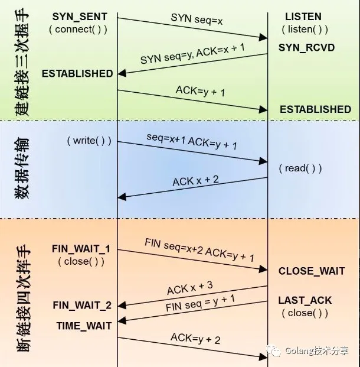

# Go 网络编程和 TCP 抓包实操

网络编程属于 IO 的范畴，其发展可以简单概括为：多进程 -> 多线程 -> non-block + I/O 多路复用。
Go 在设计网络模型时，就考虑到需要帮助开发者简化开发复杂度，降低心智负担，同时满足高性能要求。

- Go 语言的网络编程模型是 `同步网络编程`。它基于 `协程 + I/O 多路复用` （linux 下 epoll，darwin 下 kqueue，windows 下 iocp，通过网络轮询器 netpoller 进行封装），结合网络轮询器与调度器实现。
- 用户层 goroutine 中的 block socket，实际上是通过 netpoller 模拟出来的。runtime 拦截了底层 socket 系统调用的错误码，并通过 netpoller 和 goroutine 调度让 goroutine `阻塞`在用户层得到的 socket fd 上。
- Go 将网络编程的复杂性隐藏于 runtime 中：开发者不用关注 socket 是否是 non-block 的，也不用处理回调，只需在每个连接对应的 goroutine 中以 block I/O 的方式对待 socket 即可。

## TCP Server

在 Go 中，网络编程非常容易。我们通过 Go 的 net 包，可以轻松实现一个 TCP 服务器。
参考代码 [`server.go`](server/server.go)

**代码逻辑：**

1. 端口监听。通过 `net.Listen("tcp", ":8000")` 开启在端口 8000 的 TCP 连接监听。
2. 建立连接。在开启监听成功之后，调用 `net.Listener.Accept()` 方法等待 TCP 连接。Accept 方法将以 `阻塞式` 地等待新的连接到达，并将该连接作为 `net.Conn` 接口类型返回。
3. 数据传输。当连接建立成功后，我们将启动一个新的 goroutine 来处理 c 连接上的读取和写入。本文服务器的数据处理逻辑是，客户端写入该 TCP 连接的所有内容，服务器将原封不动地写回相同的内容。

## TCP Client

同样，通过 net 包也能快速实现一个 TCP 客户端。 参考代码 [`client.go`](client/client.go)

**代码逻辑：**

1. 建立连接。通过 `net.Dial("tcp", "localhost:8000")` 连接一个 TCP 连接到服务器正在监听的同一个 `localhost:8000` 地址。
2. 写入数据。当连接建立成功后，通过 `c.Write()` 方法写入数据 `Hi, beyondyyh` 给服务器。
3. 关闭连接。启动一个新的 goroutine，在 10s 后调用 `c.Close()` 方法关闭 TCP 连接。
4. 读取数据。除非发生 error，否则客户端通过 `c.Read()`  方法（注意：是阻塞式的）循环读取 TCP 连接上的内容。

## 抓包分析

```bash
tcpdump -S -nn -vvv -i lo0 port 8000
```

通过使用 `-i lo0` 指定捕获环回接口 localhost，使用 `port 8000` 将网络捕获过滤为仅与端口 8000 通信或来自端口 8000 的流量，`-vvv` 是为了打印更多的详细描述信息，-S 显示序列号绝对值。

**运行服务端代码：**

```txt
$ go run server.go
2021/10/28 12:01:00 TCP session open
2021/10/28 12:01:00 reading data from client: Hi, beyondyyh
2021/10/28 12:01:10 Error reading TCP session: EOF
```

**运行客户端代码：**

```txt
$ go run client.go
2021/10/28 12:01:00 TCP session open
2021/10/28 12:01:00 reading data from server: Hi, beyondyyh
2021/10/28 12:01:10 Error reading TCP session: read tcp [::1]:56950->[::1]:8000: use of closed network connection
exit status 1
```

解释：客户端和服务器建立连接之后，发送数据给服务端，服务端返回相同的数据 `Hi, beyondyyh` 回来。在 10s 后，客户端通过一个新的 goroutine 主动关闭了连接，因此阻塞在 `c.Read` 的客户端代码捕获到了错误：`use of closed network connection`。

那我们通过 tcpdump 抓取的本次通信过程如何呢？首先，我们先通过一张图片回顾一下经典的 TCP 通信全过程。



**以下是 tcpdump 抓取的结果：**

```txt
$ tcpdump -S -nn -vvv -i lo0 port 8000
tcpdump: listening on lo0, link-type NULL (BSD loopback), capture size 262144 bytes
1 12:07:01.846121 IP6 (flowlabel 0x4e73a, hlim 64, next-header TCP (6) payload length: 44) ::1.57350 > ::1.8000: Flags [S], cksum 0x0034 (incorrect -> 0x3253), seq 29461648, win 65535, options [mss 16324,nop,wscale 6,nop,nop,TS val 714740325 ecr 0,sackOK,eol], length 0
2 12:07:01.846186 IP6 (flowlabel 0x6f4cd, hlim 64, next-header TCP (6) payload length: 44) ::1.8000 > ::1.57350: Flags [S.], cksum 0x0034 (incorrect -> 0x8776), seq 3720843268, ack 29461649, win 65535, options [mss 16324,nop,wscale 6,nop,nop,TS val 714740325 ecr 714740325,sackOK,eol], length 0
3 12:07:01.846196 IP6 (flowlabel 0x4e73a, hlim 64, next-header TCP (6) payload length: 32) ::1.57350 > ::1.8000: Flags [.], cksum 0x0028 (incorrect -> 0xe873), seq 29461649, ack 3720843269, win 6371, options [nop,nop,TS val 714740325 ecr 714740325], length 0
4 12:07:01.846203 IP6 (flowlabel 0x6f4cd, hlim 64, next-header TCP (6) payload length: 32) ::1.8000 > ::1.57350: Flags [.], cksum 0x0028 (incorrect -> 0xe873), seq 3720843269, ack 29461649, win 6371, options [nop,nop,TS val 714740325 ecr 714740325], length 0
5 12:07:01.846347 IP6 (flowlabel 0x4e73a, hlim 64, next-header TCP (6) payload length: 45) ::1.57350 > ::1.8000: Flags [P.], cksum 0x0035 (incorrect -> 0x4822), seq 29461649:29461662, ack 3720843269, win 6371, options [nop,nop,TS val 714740325 ecr 714740325], length 13
6 12:07:01.846359 IP6 (flowlabel 0x6f4cd, hlim 64, next-header TCP (6) payload length: 32) ::1.8000 > ::1.57350: Flags [.], cksum 0x0028 (incorrect -> 0xe866), seq 3720843269, ack 29461662, win 6371, options [nop,nop,TS val 714740325 ecr 714740325], length 0
7 12:07:01.846432 IP6 (flowlabel 0x6f4cd, hlim 64, next-header TCP (6) payload length: 132) ::1.8000 > ::1.57350: Flags [P.], cksum 0x008c (incorrect -> 0x47be), seq 3720843269:3720843369, ack 29461662, win 6371, options [nop,nop,TS val 714740325 ecr 714740325], length 100
8 12:07:01.846441 IP6 (flowlabel 0x4e73a, hlim 64, next-header TCP (6) payload length: 32) ::1.57350 > ::1.8000: Flags [.], cksum 0x0028 (incorrect -> 0xe803), seq 29461662, ack 3720843369, win 6370, options [nop,nop,TS val 714740325 ecr 714740325], length 0
9 12:07:11.849647 IP6 (flowlabel 0x4e73a, hlim 64, next-header TCP (6) payload length: 32) ::1.57350 > ::1.8000: Flags [F.], cksum 0x0028 (incorrect -> 0xc12b), seq 29461662, ack 3720843369, win 6370, options [nop,nop,TS val 714750268 ecr 714740325], length 0
10 12:07:11.849726 IP6 (flowlabel 0x6f4cd, hlim 64, next-header TCP (6) payload length: 32) ::1.8000 > ::1.57350: Flags [.], cksum 0x0028 (incorrect -> 0x9a53), seq 3720843369, ack 29461663, win 6371, options [nop,nop,TS val 714750268 ecr 714750268], length 0
11 12:07:11.850032 IP6 (flowlabel 0x6f4cd, hlim 64, next-header TCP (6) payload length: 32) ::1.8000 > ::1.57350: Flags [F.], cksum 0x0028 (incorrect -> 0x9a52), seq 3720843369, ack 29461663, win 6371, options [nop,nop,TS val 714750268 ecr 714750268], length 0
12 12:07:11.850095 IP6 (flowlabel 0x4e73a, hlim 64, next-header TCP (6) payload length: 32) ::1.57350 > ::1.8000: Flags [.], cksum 0x0028 (incorrect -> 0x9a53), seq 29461663, ack 3720843370, win 6370, options [nop,nop,TS val 714750268 ecr 714750268], length 0
```

**重点关注 `Flags []`，其中：**

- `[S]` 代表 SYN 包；
- `[F]` 代表 FIN
- `[.]` 代表对应的 ACK 包，如：`[S.]`代表 SYN-ACK，`[F.]`代表 FIN-ACK。

**从上图可以很明显看出TCP通信的全过程：**

1. 第1-3行 是TCP建立连接，经典的三次握手过程；
    1. 第一次握手：客户端向服务器发起 `SYN seq=x`; （::1.57350 > ::1.8000: Flags [S], seq 29461648）
    2. 第二次握手：服务器向客户端回复 `ACK=x+1, 同时发出SYN seq=y`；（::1.8000 > ::1.57350: Flags [S.], seq 3720843268, ack 29461649）；
    3. 第三次握手：客户端向服务器回复 `ACK=y+1`。（::1.57350 > ::1.8000: Flags [.], seq 29461649, ack 3720843269）。
2. 第5-6行 是客户端发送数据；
3. 第7-8行 是服务器发送数据；
4. 第9-12行 是TCP断开连接，10s后客户端主动断开，经典的四次挥手过程；
    1. 第一次挥手：客户端发送 `FIN seq=x ACK=y`；（::1.57350 > ::1.8000: Flags [F.], seq 29461662, ack 3720843369）；
    2. 第二次挥手：服务器发送 `ACK=x+1`；（::1.8000 > ::1.57350: Flags [.], seq 3720843369, ack 29461663）；
    3. 第三次挥手：服务器发送 `FIN seq=z`；（::1.8000 > ::1.57350: Flags [F.], seq 3720843369, ack 29461663）；
    4. 第四次挥手：客户端在等待2MS后，发送 `ACK=z+1`；（::1.57350 > ::1.8000: Flags [.], seq 29461663, ack 3720843370）。
